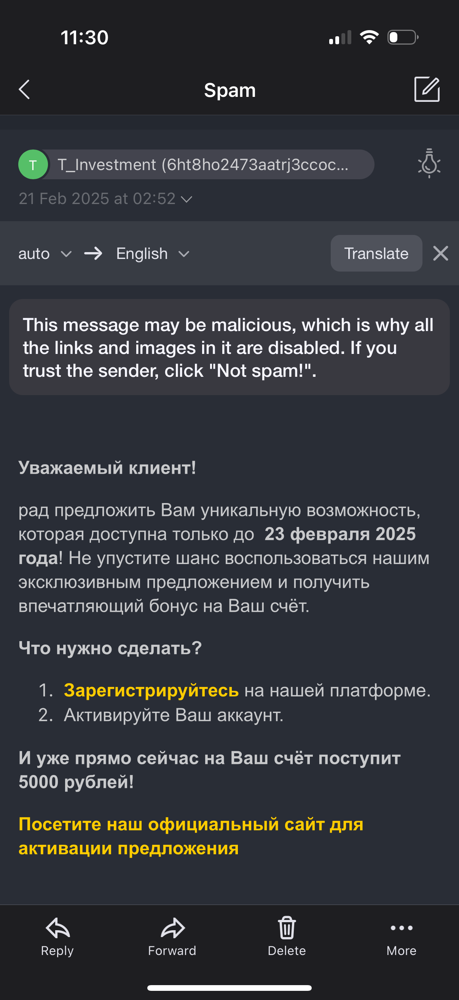

# Платежи в Интернете

Онлайн-платежи — это удобно, но важно соблюдать правила безопасности, чтобы не стать жертвой мошенников. В этом разделе мы расскажем, как безопасно оплачивать покупки в интернете, как распознать поддельные сайты и что такое технология 3D-Secure, которая защищает ваши платежи.&#x20;

### **Проверка сайтов перед оплатой**

**Как определить безопасный сайт:**

* **Протокол HTTPS**:\
  Перед вводом данных карты убедитесь, что адрес сайта начинается с **https://** (а не http://). Буква "s" означает, что соединение защищено. Также рядом с адресом должен быть значок зеленого замка.
* **Проверка домена**:\
  Обратите внимание на адрес сайта. Мошенники часто создают поддельные сайты с похожими названиями, например, "sberbankk.ru" вместо "sberbank.ru".\
  Или домен второго уровня, например "sberbank.secure.org"
* **Отзывы и репутация**:\
  Перед покупкой на новом сайте поищите отзывы о нем в интернете. Если отзывов нет или они отрицательные, лучше не рисковать.

**Осторожно с подозрительными ссылками:**

* Не переходите по ссылкам из писем, сообщений или рекламы, если не уверены в их надежности. Мошенники часто рассылают письма, которые выглядят как сообщения от банка. Они могут содержать ссылки на поддельные сайты или вложения с вирусами.&#x20;


Официальные письма от банка всегда приходят с корпоративного адреса. Если письмо пришло с подозрительного адреса (например, gmail.com или yandex.ru), это мошенничество


* Если вам пришло письмо от "банка" с просьбой перейти по ссылке, лучше вручную введите адрес сайта в браузере или позвоните в банк для уточнения.
* И не верьте в бесплатные деньги и победы в конкурсах, в которых вы даже не участвовали.

<figure><figcaption>
Пример поддельного письма якобы от банка Обратите внимание на отправителя (случайный набор символов)
</figcaption></figure>


Чтобы преверить реальный адрес отправителя, нажмите на имя отправителя в мобильном приложении. \
Сравните домен отправителя с официальном сайтом банка/организации.&#x20;


### **Использование виртуальных карт**

**Что такое виртуальная карта:**

* Это карта, которая существует только в электронном виде. Ее можно создать через банковское приложение, и она привязана к вашему основному счету.
* Виртуальная карта имеет отдельный номер, срок действия и CVV-код, но физически ее нет.

**Преимущества виртуальных карт:**

* **Безопасность**:\
  Если данные виртуальной карты попадут к мошенникам, они не смогут получить доступ к вашему основному счету. Вы можете легко заблокировать виртуальную карту без ущерба для основной.
* **Ограниченный лимит**:\
  Вы можете установить лимит на виртуальной карте, чтобы минимизировать риски.
* **Удобство для онлайн-покупок**:\
  Виртуальные карты идеально подходят для оплаты в интернете, особенно на новых или малоизвестных сайтах.

### **Безопасные способы оплаты**

**Технология 3D-Secure:**\
3D-Secure — это дополнительный уровень защиты, который используется при онлайн-платежах. Как это работает:

1. Вы вводите данные карты на сайте.
2. После этого вас перенаправляют на страницу банка, где нужно ввести одноразовый код из SMS или подтвердить платеж через банковское приложение.
3. Только после этого платеж будет выполнен.

**Преимущества 3D-Secure:**

* Даже если мошенники узнают данные вашей карты, они не смогут совершить платеж без кода из SMS.
* Все крупные банки и платежные системы (Visa, Mastercard, Мир) поддерживают эту технологию.&#x20;

### **Что делать, если что-то пошло не так**

**Подозрительные операции:**

* Если вы заметили неизвестные платежи в выписке, немедленно свяжитесь с банком и заблокируйте карту.
* Банк проведет расследование и, если платеж был мошенническим, вернет деньги.


Если вы нарушили правила, например, назвали код из SMS, банк имеет право отказать в возмещении ущерба.&#x20;


**Утечка данных:**

* Если вы подозреваете, что данные вашей карты попали к мошенникам, сразу заблокируйте карту и закажите новую.&#x20;


Некоторые банки предлагают страховку от мошеннических операций. Уточните у своего банка, есть ли такая возможность.&#x20;

