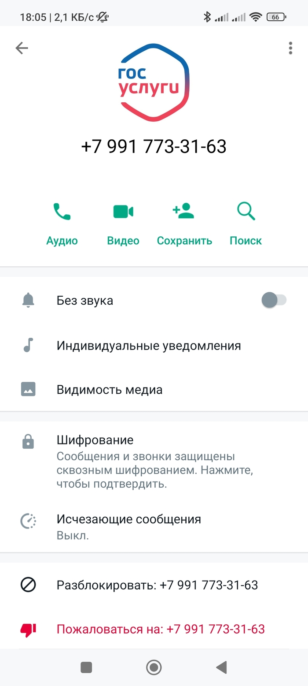

# Как распознать звонок через мессенджер

#### **1. Интерфейс звонка**

* В мессенджерах интерфейс звонка выглядит иначе, чем при обычном телефонном вызове. Попросите кого-то из близких позвонить по обыному номеру и через месседжер и сравните 2 эксрана.&#x20;
* В WhatsApp или Telegram отображается аватар звонящего. При обычном звонке фото отображаться не будет, если вы не установили его самостоятельно.&#x20;
* На экране может быть надпись, например, "WhatsApp Call" или "Звонок через Telegram". А также значок мессенджера.

***

#### **2. Номер и фото звонящего**

* **Формат номера**:
  * Если звонок поступает через мессенджер, номер может отображаться в международном формате (например, +7 XXX XXX XX XX) или вообще не отображаться, если звонящий использует скрытый номер.
* **Отсутствие номера в телефонной книге**:
  * Если номер не сохранен в ваших контактах, мессенджер может показать имя или аватар, который звонящий установил сам. То есть кто угодно можно поставить любое фото и написать любое имя.&#x20;
  * Наличие фото официальное организации более подобрительно, чем его отсуствие.&#x20;

***

#### **3. Уведомление о звонке**

* **Уведомление в мессенджере**:
  * Если звонок поступает через мессенджер, вы можете увидеть уведомление в самом приложении (например, "Входящий звонок в WhatsApp").
* **Отсутствие уведомления о пропущенном звонке в журнале вызовов**:
  * Если вы не ответили на звонок через мессенджер, он не отобразится в стандартном журнале вызовов вашего телефона. Вместо этого вы увидите уведомление в самом мессенджере.

***

#### **Как проверить, откуда звонок**

* **Посмотрите на экран вызова**: Если звонок через мессенджер, это будет указано (например, "WhatsApp Call").
* **Проверьте журнал вызовов**: Если звонок был через мессенджер, он не отобразится в стандартном журнале вызовов.
* **Откройте мессенджер**: Если звонок был пропущен, вы увидите уведомление в самом приложении.

Пример аккаунта мошшеников, которые звонят якобы от Госуслуг.&#x20;

***

#### **Почему это важно?**

Мошенники часто используют мессенджеры для звонков, чтобы:

* Скрыть свой реальный номер.
* Использовать поддельные фото и имена (например, логотип банка или полиции или госуслуг, как на примере выше).
* Вызвать доверие, имитируя звонки от официальных организаций.

***

#### **Что делать, если звонят через мессенджер**

1. **Не отвечайте на звонки от незнакомых номеров**.&#x20;
2. **Проверьте номер**: Если звонящий представляется сотрудником банка или другой организации, перезвоните по официальному номеру.
3. **Не сообщайте личные данные**: Никогда не называйте коды из SMS, пароли или данные карт.\
   Не устанавливайте приложения. \
   Не демонстрируйте экран.&#x20;
4. **Блокируйте подозрительные номера**: Если звонок кажется подозрительным, добавьте номер в черный список.


[primery-iz-novostei.md](primery-iz-novostei.md)

