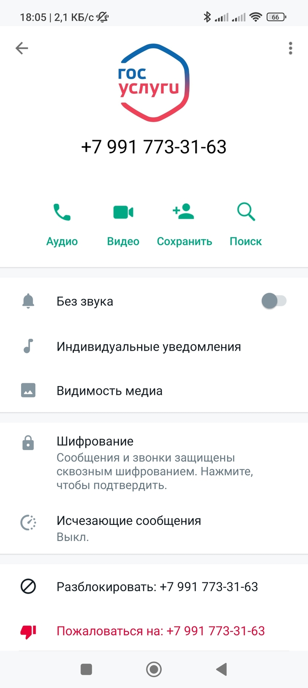

# Как распознать мошенников

### **Основные признаки**

* **Они требуют срочных действий**: Мошенники создают искусственное ощущение чрезвычайной ситуации, например: "Ваш счет взломан, нужно срочно перевести деньги!" или "Ваш родственник в беде, помогите немедленно!". Помните: настоящие сотрудники организаций никогда не будут давить на вас и требовать мгновенных решений.
* **Просят вас совершить конкретные действия**: Перевести деньги на "безопасный счет", снять наличные, купить криптовалюту, передать средства "курьеру" или "участвовать в задержании преступников". Никогда не делайте этого по просьбе незнакомцев.&#x20;


Безопасных счетов не существует.&#x20;



Правоохранительные органы никогда не просят граждан участвовать в операциях или передавать деньги.&#x20;


* **Настаивают на сохранении разговора в тайне**: Мошенники могут говорить: "Не рассказывайте никому, это секретная операция". Это явный признак обмана.
*   Могут имитировать официальные организации, используя поддельные номера и имена.&#x20;

    **Госуслуги и служба безопасности банка никогда не звонят первыми**: Официальные организации (банки, полиция, госучреждения) не звонят с просьбами перевести деньги, сообщить данные карт или участвовать в операциях. Если вам звонят от их имени — это мошенники.
* **Звонки через WhatsApp, Telegram и поддельные фото**: Мошенники часто используют мессенджеры, чтобы вызвать доверие. Они могут ставить фото логотипов банков, полиции или госучреждений. Наличие таких фото — подозрительный признак. \
  Если звонят родственники или знакомые всегда сравнивайте номер и фото звонящего с теми, что записаны у вас в контактах. Если они не совпадают — это мошенники.
* **Поддельные номера и имена**: Мошенники могут подделывать номера, чтобы они выглядели как официальные. Не доверяйте только потому, что номер "похож на настоящий". Всегда перезванивайте по официальным номерам, указанным на сайте официальном организации.


В России запретили использовать IP-телефонию для звонков на мобильные и стационарные телефоны. Этой технологией чаще всего пользовались мошенники, т.к. она позволяла подменять номера. \
Однако у мошенников все еще существует возможность звонков через мессенджеры.&#x20;


* **Звонит человек, представляется должностным лицом и называет фамилию, имя, отчество**. Вы можете проверить эту информацию в интернете. Скорее всего Вы действительно найдете такого человека. Но это не повод доверять. Мошенники имеют доступ к той же информации в том же интернете, что и вы. Они стали очень изобретательны в попытке вызвать доверие!


Должностное лицо в случае любого уголовного дела, будь вы свидетелем или подозреваемым, вызовет на допрос повесткой\
Просите направить Вам официальный запрос


***

### **Что делать, если вам звонят, и вы сомневаетесь**

* &#x20;**Завершите разговор**. Скажите, что вам нужно время, чтобы все обдумать, и завершите разговор. Если звонящий представляется сотрудником банка, полиции или другой организации, найдите их официальный номер на сайте и перезвоните сами.
* &#x20;**Задайте неожиданный вопрос**. Если звонящий представляется вашим родственником или знакомым, задайте вопрос, ответ на который знаете только вы и этот человек. Например: "Как зовут нашу собаку?" или "Какой подарок я тебе подарил на прошлый день рождения?".
* &#x20;**Назовите родственника другим именем**. Если звонящий говорит, что он ваш родственник, намеренно назовите его неправильным именем. Например, если это якобы ваш сын, скажите: "Андрей, это ты?" (если его имя не Андрей). Мошенник, скорее всего, согласится, что выдаст его.
* &#x20;**Сравните номер и фото**. Если звонок поступил через мессенджер (WhatsApp, Telegram), сравните номер и фото звонящего с теми, что записаны у вас в контактах. Несовпадение — явный признак мошенничества.


Официальные организации никогда не будут использовать мессенджеры для связи с вами.&#x20;


Как распознать звонок через мессенджер

Распознать, что звонок поступает не по обычному телефонному соединению, а через мессенджер (WhatsApp, Telegram, Viber и другие), можно по нескольким признакам.&#x20;

***

#### **1. Интерфейс звонка**

* **Отличия в экране вызова**:
  * В мессенджерах интерфейс звонка выглядит иначе, чем при обычном телефонном вызове. Например, в WhatsApp или Telegram отображается аватар звонящего, а также название или значок мессенджера.
  * На экране может быть надпись, например, "WhatsApp Call" или "Звонок через Telegram".

***

#### **2. Номер звонящего**

* **Формат номера**:
  * Если звонок поступает через мессенджер, номер может отображаться в международном формате (например, +7 XXX XXX XX XX) или вообще не отображаться, если звонящий использует скрытый номер.
* **Отсутствие номера в телефонной книге**:
  * Если номер не сохранен в ваших контактах, мессенджер может показать только имя или аватар (если они есть у звонящего).

***

#### **3. Уведомление о звонке**

* **Уведомление в мессенджере**:
  * Если звонок поступает через мессенджер, вы можете увидеть уведомление в самом приложении (например, "Входящий звонок в WhatsApp").
* **Отсутствие уведомления о пропущенном звонке в журнале вызовов**:
  * Если вы не ответили на звонок через мессенджер, он не отобразится в стандартном журнале вызовов вашего телефона. Вместо этого вы увидите уведомление в самом мессенджере.

***

#### **6. Фото и имя звонящего**

* **Отображение аватара и имени**:
  * В мессенджерах часто отображается фото (аватар) и имя звонящего, если они есть в ваших контактах или в профиле звонящего.
* **Подозрительные фото**:
  * Если звонящий использует фото логотипа банка, полиции или другой организации, это может быть признаком мошенничества.

***

#### **Как проверить, откуда звонок**

* **Посмотрите на экран вызова**: Если звонок через мессенджер, это будет указано (например, "WhatsApp Call").
* **Проверьте журнал вызовов**: Если звонок был через мессенджер, он не отобразится в стандартном журнале вызовов.
* **Откройте мессенджер**: Если звонок был пропущен, вы увидите уведомление в самом приложении.

Пример аккаунта мошшеников, которые звоняк якобы от Госуслуг.&#x20;

***

#### **Почему это важно?**

Мошенники часто используют мессенджеры для звонков, чтобы:

* Скрыть свой реальный номер.
* Использовать поддельные фото и имена (например, логотип банка или полиции или госуслуг, как на примере выше).
* Вызвать доверие, имитируя звонки от официальных организаций.

***

#### **Что делать, если звонят через мессенджер**

1. **Не отвечайте на звонки от незнакомых номеров**.&#x20;
2. **Проверьте номер**: Если звонящий представляется сотрудником банка или другой организации, перезвоните по официальному номеру.
3. **Не сообщайте личные данные**: Никогда не называйте коды из SMS, пароли или данные карт.
4. **Блокируйте подозрительные номера**: Если звонок кажется подозрительным, добавьте номер в черный список.

* **Обратитесь за помощью**. Если сомневаетесь, проконсультируйтесь с близкими, коллегами или позвоните в банк/полицию для проверки. Только мошенники просят держать разговор в тайне.&#x20;

***

#### А если  мне правда отключат телефон?

Мошенники все чаще стали использовать бытовые ситуации, поэтому надо быть вдвойне аккуратнее.&#x20;

Вам действительно может позвонить управляющая компания или телефонная служба.&#x20;

**Что нормально:**

* Управляющая компания (УК) может звонить, чтобы, например, сообщить о плановой замене счетчиков. \
  Телефонная компания, чтобы проинформировать о плановых работах или задолженности.&#x20;
* Сотрудник УК может согласовать с вами удобное время для визита мастера.&#x20;

**Что должно насторожить:**

* Давление и угрозы: "Если не замените сейчас, будет штраф/отключение услуг".
* Просьба назвать код из SMS для подтверждения заявки или чего-либо.&#x20;
* Просьба установить стороннее приложение или произвести демонстрацию экрана.&#x20;

> Мошенники используют открытые базы данных для поиска информации о необходимости замены счетчиков. Они связываются с потенциальными жертвами, представляясь специалистами, и назначают визит. После этого приходит СМС с кодом от Госуслуг, который они пытаются выманить у жертвы.
>
> Источник: [https://beelinenow.ru/articles/bilayn-rasskazal-o-samykh-populyarnykh-moshennicheskikh-skhemakh-v-2024-godu/](https://beelinenow.ru/articles/bilayn-rasskazal-o-samykh-populyarnykh-moshennicheskikh-skhemakh-v-2024-godu/)

***

#### **Мне кажется, я распознал мошенников. Можно ли продолжить с ними разговор и подшутить в ответ?**

Не стоит. \
Вы заранее никогда не знаете, как цель у звонящего. Например, ему нужна просто информация о вас, а заболтавшись, легко выболтать то, о чем вы не собирались рассказывать. \
Либо ему важно записать ваш голос, чтобы подделывать проверки биометрии или имитировать вас с помощью искусственного интеллекта в разговоре с вашими близкими. Чем больше всего вы произнесете, тем проще будет это сделать.&#x20;

В любом случае, лучше сразу положить трубку и добавить номер в черный список.\
Помните, мошенники как правило хорошие психологи. И чем дольше вы поддеживаете разговор, тем более вероятно, вы станете жертвой мошенничества.&#x20;
