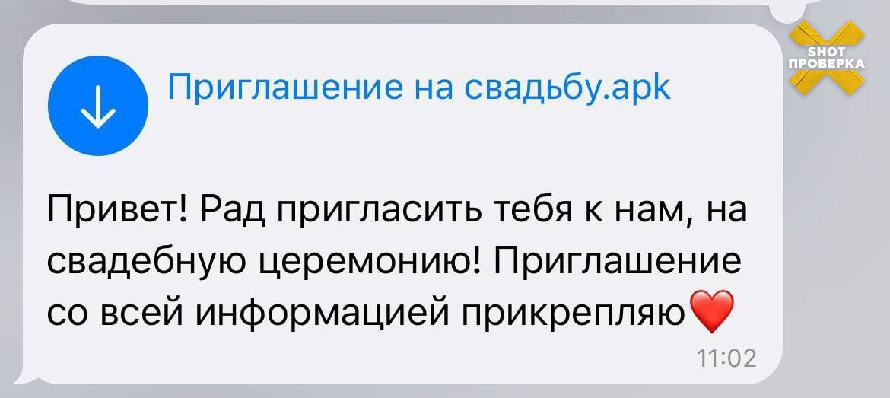

# Вредоносные файлы

Файлы, которые вам присылают в мессенджерах, могут быть не менее опасны, чем подозрительные ссылки. Мошенники часто используют вредоносные файлы, чтобы получить доступ к вашему устройству, украсть данные или заразить его вирусами. Чтобы защититься, важно понимать, какие файлы могут быть опасными и как их распознать.&#x20;

> Мошенники рассылают вирус под видом видео, обычно с подписью «Это ты?». При открытии файла вирус загружается на телефон и получает доступ к push-уведомлениям, СМС и фотографиям, а также рассылает вредоносный файл всем контактам пользователя в мессенджере.
>
> _Источник_: [https://t.me/moscowmap](https://t.me/moscowmap)

### **Что такое расширения файлов?**

Расширение файла — это часть его названия, которая указывает на тип файла и помогает устройству понять, как его открыть. Оно обычно состоит из точки и нескольких букв (например, `.doc`, `.jpg`, `.exe`). Вот несколько примеров:

* **.doc / .docx** — текстовый документ (Microsoft Word).
* **.jpg / .png** — изображение.
* **.mp3** — аудиофайл.
* **.exe** — исполняемый файл (программа).
* **.apk** — файл для установки приложений на Android.

Расширение помогает понять, что за файл перед вами, но мошенники могут маскировать вредоносные файлы под безопасные. Например, файл с названием «photo.jpg.exe» может показаться изображением, но на самом деле это программа, которая установит вирус на ваш компьютер.&#x20;


Обращайте внимание исключительно на последнюю часть имени.&#x20;


#### **Какие файлы могут быть опасными?**

1. **Исполняемые файлы (.exe, .bat, .cmd):**
   * Эти файлы запускают программы или скрипты на вашем устройстве.
   * Пример: файл «setup.exe» может установить вредоносное ПО.
   * **Что делать:** Никогда не открывайте такие файлы от неизвестных отправителей.
2. **.apk-файлы:**
   * Это файлы для установки приложений на Android. Они не проходят проверку Google Play, поэтому могут содержать вирусы.
   * Пример: файл «game.apk» может установить программу, которая украдет ваши данные.
   * **Что делать:** Скачивайте приложения только из официального магазина Google Play.
3. **Скрипты и файлы с двойным расширением:**
   * Файлы с двойным расширением (например, «photo.jpg.exe») маскируются под безопасные, но на самом деле являются вредоносными.
   * **Что делать:** Внимательно проверяйте расширения файлов перед открытием.

<figure><figcaption>
Пример вредоносного файла под видом приглашения на свадьбу
</figcaption></figure>

***

### **Как защититься?**

1. **Отключите автозагрузку файлов:**\
   Это можно сделать в настройках мессенджера\
   "Настройки" -> "Данные ипамять" -> "Автозагрузка медиа" и выберите "Никогда"
2. **Не открывайте файлы от неизвестных отправителей:**\
   Даже если файл выглядит безобидно, он может быть опасным.
3. **Проверяйте расширения файлов:**\
   Если вы видите двойное расширение (например, «document.pdf.exe»), это явный признак подозрительного файла.
4. **Используйте антивирус:**\
   Перед открытием файла проверьте его антивирусной программой.
5. **Не скачивайте .apk-файлы из ненадежных источников:**\
   Устанавливайте приложения только из официального магазина Google Play.
6. **Включите защиту в мессенджерах:**\
   Например, в Telegram можно запретить автоматическую загрузку файлов в настройках.

***

### **Примеры мошеннических сообщений с файлами**

* «Вот документ с важной информацией, откройте его» (прикреплен файл «document.doc»).
* «Вы получили фото, скачайте его» (файл «photo.jpg.exe»).
* «Установите это приложение, чтобы получить бонус» (файл «bonus.apk»).

Подозрительные файлы — это скрытая угроза, которая может привести к взлому вашего устройства или утечке данных. Всегда проверяйте расширения файлов, не открывайте их от незнакомцев и используйте антивирус для дополнительной защиты. Помните: лучше перестраховаться, чем потом бороться с последствиями.
