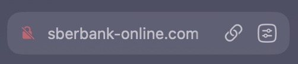
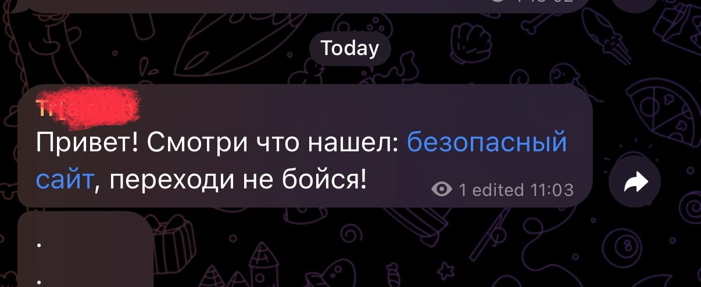
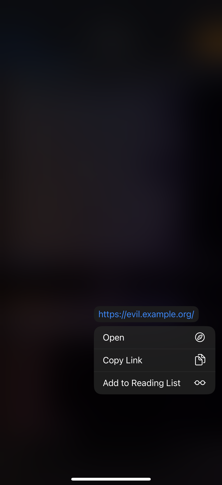

# Как распознать фишинговый сайт

Сайт - это аналог домашнего адреса, только в интернете. Он состоит из нескольких частей:

```
https://web.example.org/page?paraemeter=value
```

`https://` - это протокол, способ, котором вы обращаетесь к сайту. Например, поедете вы в банк на машине или автобусе. буква S (httpS) означает Secure, то есть безопасный. Если ее нет, это повод насторожиться.&#x20;

Далее стоит обращать внимание на все, что находится между двумя слешами (//) и следующим слешом (/). Тут `web.example.org` - это адрес организации

* `.org` - Это город, может быть `.ru`, `.com` и другие значения
* `.example.` - Это дом в городе. Тут могут быть любые символы: буквы, цифры, дефисы. Надо смотреть на то, что находится между точек. Это настоящий адрес. Если вы едете в сбербанк или на госуслуги, убедитесь, что вы едете в правильный "дом".&#x20;
* `web.`- Это помещения или квартиры в доме. Если адрес дома правильный, то тут может быть что угодно. Часто большие сайты разбивают на такие "помещения" (поддомены), чтобы разделить функционал.&#x20;

Все, что находится после первого слеша (/) - это конкретные комнаты и указания, где в комнате найти нужную информацию. Опять, если вы пришли в правильный дом, то перемещаться по комнатам почти всегда безопасно.&#x20;

***

**1. Проверьте доменное имя (адрес сайта)**

* **Ошибки в написании:**\
  Фишинговые домены часто имитируют настоящие, но с опечатками или заменой символов. Например:
  * `paypa1.com` вместо `paypal.com - цифра 1 вместо буквы L`
  * `facebokk.com` вместо `facebook.com`
* **Лишние символы:**\
  Домены могут содержать дополнительные слова или символы, например:
  * `facebook-secure-login.com`
  * `paypal-verify.com`
* **Отсуствие сертификата (буквы S в протоколе):**\
  Это можно распознать по красному или перечеркнутому значку замка около адреса сайта.&#x20;

<figure><figcaption><p>Пример фишингового сайта</p></figcaption></figure>

***

**2. Проверьте домены (адрес дома)**&#x20;

* Фишинговые сайты могут использовать поддомены, чтобы выглядеть легитимно. \
  Настоящее имя сайта (домен) - это то, что находится между двух точек перед .ru, .com, .org\
  Читать надо с конца. \
  \
  Например:
  * `facebook.login-security.com` (настоящий домен — `login-security.com`, а не `facebook`).
* Настоящие сайты редко используют длинные или сложные поддомены.

✅ `https://gosuslugi.ru` - официальный сайт\
❌ `https://gosuslugi.on1ine.ru` - сайт `on1ine.ru`, а не `gosuslugi.ru`\
❌ `https://lk-gosuslugi.ru` - сравниваем то, что между точек `lk-gosuslugi` ≠ `gosuslugi`\
❌ `https://gossuslugi.ru` - опечатка в домене, лишняя буква S\
✅ `https://esia.gosuslugi.ru` - поддомен официального сайта, все ок, можно доверять\
❌ `https://gosuslugi.ru.online-lk.ru` - сайт `online-lk.ru`, смотрим всегде с конца


Сейчас мошеннические сайты превентивно блокируют, но мошенники могут быть очень изобретательны, поэтому всегда стоит быть предельно внимательным.&#x20;


***

**3. Обратите внимание на дизайн сайта**

* **Некачественный дизайн:**\
  Фишинговые сайты часто выглядят неряшливо: кривые кнопки, странные шрифты, ошибки в тексте.
* **Логотипы и брендинг:**\
  Мошенники могут использовать логотипы известных компаний, но их качество часто низкое.

***

**4. Проверьте URL перед вводом данных**

* **Не нажимайте на ссылки сразу:**\
  Наведите курсор на ссылку (на ПК) или задержите палец на ней (на смартфоне), чтобы увидеть настоящий адрес.\
  Часто настоящий адрес может быть вообще не виден.&#x20;

<figure><figcaption><p>Как может выглядеть ссылка в сообщении</p></figcaption></figure>

<figure><figcaption><p>Если долго задержать нажатие, <br>то можно увидеть,<br>что она вовсе не безопасна</p></figcaption></figure>

* **Сравните с официальным доменом:**\
  Убедитесь, что адрес совпадает с официальным сайтом компании.

***

**5. Используйте инструменты для проверки**

* **Антивирусы:**\
  Некоторые антивирусы (например, Kaspersky) проверяют ссылки на фишинг.

***

**6. Остерегайтесь срочных запросов и вспывающих окон**

* Фишинговые сайты часто создают ощущение срочности:
  * «Ваш аккаунт будет заблокирован!»
  * «Срочно подтвердите данные!»
  * «На вашем устройстве обнаружен вирус!»
* Фишинговые сайты могут просить установить приложение:
  * «Для просмотра фото необходимо установить приложение»\
    Если вы нажмете "да" или "продолжить", вы можете установить вредоносную или шпионскую программу на ваш смартфон и предоставить злоумышленникам доступ к вашим данным и банковским приложениям. \
    Закройте сайт.&#x20;


Приложение не может установиться на ваш смартфон без вашего ведома. От вас требуется подтвердить действие.&#x20;

Внимательно читайте уведомления.&#x20;

"Вы точно хотите установить приложение из недоверенного источника?"

НЕТ! Не хотите. Не надо нажимать на все кнопки, лишь бы открыть фото. Если это вирус, фото все равно не откроется. А денег вы лишитесь.&#x20;


***

Если что-то кажется подозрительным, закройте сайт.


[vredonosnye-faily.md](vredonosnye-faily.md)

