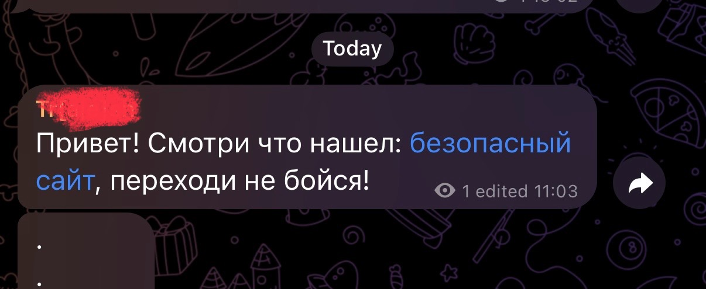

# Подозрительные ссылки

Переход по подозрительным ссылкам — одна из самых распространенных ошибок, которая может привести к серьезным последствиям. Мошенники часто маскируют свои уловки под безобидные сообщения, чтобы заставить вас перейти по ссылке.&#x20;

> Мошенники придумали новую схему развода через Телеграм. От имени знакомых они рассылают ссылку на якобы онлайн-голосование. Но перейдя по такой ссылке можно потерять свой аккаунт.&#x20;
>
> _Источник:_ [https://t.me/moscowmap](https://t.me/moscowmap)

### **Чем грозит переход по подозрительной ссылке**

* **Взлом аккаунта:**\
  Ссылка может вести на фишинговый сайт, который выглядит как страница входа в мессенджер или другой сервис. Если вы введете свои данные (логин и пароль), мошенники получат доступ к вашему аккаунту.
* **Утечка личных данных:**\
  Некоторые ссылки ведут на сайты, которые запрашивают вашу личную информацию: номер телефона, адрес, данные банковской карты. Эти данные могут быть использованы для мошенничества или продажи третьим лицам.
* **Заражение устройства вирусами:**\
  Ссылка может привести к автоматической загрузке вредоносного ПО, которое украдет ваши данные, повредит файлы или даже заблокирует устройство, требуя выкуп за разблокировку (это называется "вирус-шифровальщик").
* **Финансовые потери:**\
  Некоторые ссылки ведут на поддельные сайты, где вас могут попросить оплатить что-либо или ввести данные банковской карты.

> Мошенники начали через электронную почту или мессенджеры «вызывать» россиян для якобы участия в коллегии присяжных заседателей. Для отказа от участия прикрепляют фейковую ссылку — переход по ней предоставляет мошенникам доступ к паролям от приложений, в том числе банковских.
>
> _Источник_: [https://t.me/moscowmap](https://t.me/moscowmap)

### **Что такое подозрительная ссылка**

* **Незнакомые отправители:**\
  Если сообщение пришло от человека, которого вы не знаете, не переходите по ссылке.\
  Если сообщение пришло от знакомого, с которым вы постоянно общаетесь, но сейчас история переписки пуста, внимательно посмотрите на фото и имя. Скорее всего это мошенник маскируется под начальника, родственника, коллегу.&#x20;


Большинство современных мессенджеров имеют встроенные функции безопасности, которые предупреждают пользователей, если сообщение пришло от человека, которого нет в списке контактов. Обращайте внимание.


* **Слишком заманчивые предложения:**\
  Сообщения вроде «Вы выиграли iPhone! Перейдите по ссылке, чтобы получить приз» или «Срочно! Ваш аккаунт будет заблокирован, если вы не подтвердите данные» — это классические уловки мошенников.

> В преддверии распродаж мошенники создают страницы с товарами по сниженным ценам. Покупатели оформляют заказы, а затем получают сообщение о том, что товар закончился. Им предлагается приобрести аналогичный товар или воспользоваться скидкой на другие товары. При переходе по ссылке в Telegram происходит взлом аккаунта.
>
> _Источник_: [https://beelinenow.ru/articles/bilayn-rasskazal-o-samykh-populyarnykh-moshennicheskikh-skhemakh-v-2024-godu/](https://beelinenow.ru/articles/bilayn-rasskazal-o-samykh-populyarnykh-moshennicheskikh-skhemakh-v-2024-godu/)

* **Сокращенная ссылки:**\
  Если ссылка выглядит как короткий набор букв и цифр (например, **bit.ly/12345**), это может быть попытка скрыть настоящий адрес сайта.\
  Если ссылка замаскирована (вы не видите реальный адрес) - не переходите.&#x20;

<details>

<summary>Маскировка ссылок с помощью Markdown</summary>

Markdown — это простой язык разметки, который позволяет красиво оформлять текст, в том числе маскировать ссылки. Это может быть полезно, но также опасно, так как мошенники используют эту функцию, чтобы скрыть настоящие адреса.

***

**Как это работает:**

* **Формат:**\
  `[текст](ссылка)`\
  Например: `[Нажми сюда](https://example.com)`\
  На экране будет выглядеть как: [Нажми сюда](https://example.com)
* **Опасность:**\
  Мошенники могут замаскировать вредоносную ссылку под безобидный текст, например:\
  `[Скачать фото](https://вредоносный-сайт.com)`

***

**Как защититься:**

* Не нажимайте на замаскированные ссылки от незнакомцев.
* Наведите курсор на ссылку (на ПК) или задержите палец (на смартфоне), чтобы увидеть настоящий адрес.

</details>

> Мошенники начали воровать Telegram-аккаунты россиян с помощью домовых чатов. Аферисты развешивают по подъездам объявления с приглашением вступить в чат для жильцов. После сканирования кода аккаунт угоняют.&#x20;
>
> _Источник_: [https://t.me/moscowmap](https://t.me/moscowmap)

* **QR-код:**

QR-код - это та же ссылка, только в другом виде.


QR-код сам по себе не подозрителен. Это удобный и быстрый способ поделиться информацией.&#x20;

Но всегда надо проверять, куда он ведет.&#x20;


> Мошенники начали подбрасывать в почтовые ящики фальшивые квитанции ЖКУ, практически неотличимые от оригиналов. Люди сканируют QR-код и переводят деньги, а вместе с ними уходят все личные данные и устанавливается шпионская программа на телефон.&#x20;
>
> _Источник_: [https://t.me/moscowmap](https://t.me/moscowmap)

<details>

<summary>QR-код - как еще один способ замаскировать ссылку</summary>

QR-код - это та же ссылка, только в другом виде, где сразу сложнее определить, куда она ведет. \
QR-коды стали популярным инструментом для быстрого обмена информацией, но они также могут быть использованы мошенниками для взлома аккаунтов, распространения вредоносных программ или фишинга.

Мошенники могут размещать QR-коды в публичных местах (на улицах, в транспорте) или отправлять их через мессенджеры. Сканирование такого кода может привести к:

* Переходу на фишинговый сайт.
* Автоматической загрузке вредоносного файла.
* Взлому аккаунта (например, если QR-код используется для входа в мессенджер).

QR-код может выглядеть безобидно, но вести на опасный сайт или запускать вредоносное действие.

* Не переходите по ссылке сразу. Проверьте URL-адрес, который появился после сканирования.
* Обратите внимание на доменное имя: если оно выглядит подозрительно (например, с опечатками или лишними символами), не переходите по ссылке.

Некоторые мессенджеры (например, WhatsApp, Telegram) используют QR-коды для входа в веб-версию или на другие устройства. Если вы отсканируете такой код, мошенник сразу получит доступ к вашему аккаунту.

* Регулярно проверяйте активные сессии в мессенджерах (например, в Telegram: «Настройки» → «Устройства»).
* Если обнаружите подозрительную активность, немедленно выйдите из всех сессий и смените пароль.

QR-коды для оплаты могут быть поддельными, что приведет к переводу денег мошенникам

* Используйте QR-коды для оплаты только в проверенных местах (например, в магазинах или ресторанах, на терминалах при оплате).
* Проверяйте сумму платежа и получателя перед подтверждением.

**Итог**\
Чтобы обезопасить себя при работе с QR-кодами:

1. Сканируйте только доверенные коды.
2. Проверяйте источник и URL после сканирования.
3. Не используйте QR-коды для входа в аккаунты от незнакомцев.
4. Установите антивирус для дополнительной защиты.

</details>

* **Ошибки в тексте:**\
  Обратите внимание на грамматические ошибки, странные формулировки или подозрительные домены (например, «whatsapp-secure.com» вместо «whatsapp.com»).

### Как распознать фишинговый сайт

Фишинговые сайты создаются мошенниками, чтобы обманом заставить вас ввести личные данные (логины, пароли, данные банковских карт). Вот несколько способов распознать такой домен:

***

Сайт - это аналог домашнего адреса, только в интернете. Он состоит из нескольких частей:

```
https://web.example.org/page?paraemeter=value
```

`https://` - это протокол, способ, котором вы обращаетесь к сайту. Например, поедете вы в банк на машине или автобусе. буква S на конце означает Secure, то есть безопасный. Если ее нет, это повод насторожиться.&#x20;

Далее стоит обращать внимание на все, что находится между двумя слешами (//) и следующим слешом (/). Тут `web.example.org` - это адрес организации

* `.org` - Это город, может быть `.ru`, `.com` и другие значения
* `.example.` - Это дом в городе. Тут могут быть любые символны: буквы, цифры, дефисы. Надо смотреть на то, что находится между точек. Это настоящий адрес. Если вы едете в сбербанк или на госуслуги, убедитесь, что вы едете в правильный "дом".&#x20;
* `web.`- Это помещения или квартиры в доме. Если адрес дома правильный, то тут может быть что угодно. Часто большие сайты разбивают на такие "помещения" (поддомены), чтобы разделить функционал.&#x20;

Все, что находится после первого слеша (/) - это конкретные комнаты и указания, где в комнате найти нужную информацию. Опять, если вы пришли в правильный дом, то перемещаться по комнатам почти всегда абсолютно безопасно.&#x20;

**1. Проверьте доменное имя (адрес сайта)**

* **Ошибки в написании:**\
  Фишинговые домены часто имитируют настоящие, но с опечатками или заменой символов. Например:
  * `paypa1.com` вместо `paypal.com - цифра 1 вместо буквы L`
  * `facebokk.com` вместо `facebook.com`
* **Лишние символы:**\
  Домены могут содержать дополнительные слова или символы, например:
  * `facebook-secure-login.com`
  * `paypal-verify.com`
* **Отсуствие сертификата (буквы S в транспорте):**\
  Это можно распознать по красному или перечеркнутому значку замка около адреса сайта.&#x20;

<figure><figcaption><p>Пример фишингового сайта</p></figcaption></figure>

***

**2. Проверьте поддомены**&#x20;

* Фишинговые сайты могут использовать поддомены, чтобы выглядеть легитимно. \
  Настоящее имя сайта (домен) - это то, что находится между двух точек перед .ru, .com, .org\
  Например:
  * `facebook.login-security.com` (настоящий домен — `login-security.com`, а не `facebook.com`).
* Настоящие сайты редко используют длинные или сложные поддомены.

✅ `https://gosuslugi.ru` - официальный сайт\
❌ `https://gosuslugi.on1ine.ru` - сайт `on1ine.ru`, а не `gosuslugi.ru`\
❌ `https://lk-gosuslugi.ru` - сравниваем то, что между точек `lk-gosuslugi` ≠ `gosuslugi`\
❌ `https://gossuslugi.ru` - опечатка в домене, лишняя буква S\
✅ `https://esia.gosuslugi.ru` - поддомен официального сайта, все ок, можно доверять\
❌ `https://gosuslugi.ru.online-lk.ru` - сайт `online-lk.ru`, смотрим всегде с конца


Сейчас мошеннические сайты превентивно блокируют, но мошенники могут быть очень изобретательны, поэтому всегда стоит быть предельно внимательным.&#x20;


***

**3. Обратите внимание на дизайн сайта**

* **Некачественный дизайн:**\
  Фишинговые сайты часто выглядят неряшливо: кривые кнопки, странные шрифты, ошибки в тексте.
* **Логотипы и брендинг:**\
  Мошенники могут использовать логотипы известных компаний, но их качество часто низкое.

***

**4. Проверьте URL перед вводом данных**

* **Не нажимайте на ссылки сразу:**\
  Наведите курсор на ссылку (на ПК) или задержите палец на ней (на смартфоне), чтобы увидеть настоящий адрес.\
  Часто настоящий адрес может быть вообще не виден.&#x20;

<figure><figcaption><p>Как может выглядеть ссылка в сообщении</p></figcaption></figure>

<figure><figcaption><p>Если долго задержать нажатие, <br>то можно увидеть,<br>что она вовсе не безопасна</p></figcaption></figure>

* **Сравните с официальным доменом:**\
  Убедитесь, что адрес совпадает с официальным сайтом компании.

***

**5. Используйте инструменты для проверки**

* **Антивирусы:**\
  Некоторые антивирусы (например, Kaspersky) проверяют ссылки на фишинг.

***

**7. Остерегайтесь срочных запросов**

* Фишинговые сайты часто создают ощущение срочности:
  * «Ваш аккаунт будет заблокирован!»
  * «Срочно подтвердите данные!»
* Настоящие компании редко требуют срочных действий через ссылки.

***

Если что-то кажется подозрительным, не вводите свои данные и закройте сайт.

### **Как защититься**


Лучшая защита - не переходить по ссылкам вовсе, если не уверены.&#x20;

Один клик может стать причиной того, что ваш аккаунт окажется в руках злоумышленников.&#x20;


1. **Не переходите по ссылкам от незнакомцев:**\
   Даже если сообщение кажется важным, лучше проигнорировать его или удалить.\
   Не сканируйте подозрительные QR-коды, особенно в общественных местах.&#x20;
2. **Проверяйте ссылки:**\
   Если сообщение пришло от знакомого, но вызывает подозрения, уточните у него лично, действительно ли он отправлял эту ссылку.
3. **Не вводите личные данные на подозрительных сайтах:**\
   Если вы перешли по ссылке и сайт запрашивает ваши данные, закройте его и проверьте аккаунт на предмет взлома.
4. **Включите защиту в мессенджерах:**\
   Например, в Telegram можно проверять ссылки антивирусом при переходе.

<details>

<summary>Проверка ссылок в мессенджерах с помощью антивируса</summary>

Источник: [https://support.kaspersky.ru/kaspersky-for-android/11.118/207046](https://support.kaspersky.ru/kaspersky-for-android/11.118/207046)

**1. Установите Kaspersky для Android**

* Скачайте приложение из официального магазина Google Play.
* Запустите установку и следуйте инструкциям на экране.

***

**2. Включите защиту от опасных ссылок**

* Откройте приложение Kaspersky -> Перейдите в раздел «Защита в интернете» или «Проверка ссылок». -> Активируйте функцию проверки ссылок.
* Установите Google Chrome в качестве браузера по умолчанию.
* Отключите встроенный браузер Telegram, чтобы настроить проверку открытых в мессенджере Telegram ссылок.

***

**3. Как это работает**

* Антивирус автоматически проверяет все ссылки, которые вы открываете в браузере или мессенджерах.
* Если ссылка ведет на опасный сайт, Kaspersky заблокирует ее и предупредит вас.

</details>

### **Примеры мошеннических сообщений**

* «Ваш аккаунт будет заблокирован через 24 часа. Перейдите по ссылке, чтобы восстановить доступ».
* «Вы получили голосовое сообщение. Нажмите на ссылку, чтобы прослушать».
* «Поздравляем! Вы выиграли 10 000 рублей. Перейдите по ссылке, чтобы получить приз».

Подозрительные ссылки — это один из главных инструментов мошенников. Никогда не переходите по ссылкам от незнакомцев, даже если они выглядят безобидно. Лучше лишний раз перестраховаться, чем стать жертвой взлома или мошенничества.

> Мошенники стали воровать Telegram аккаунты через секретные чаты. Приходит сообщение от якобы «поддержки» с предупреждением об удалении аккаунта. Чтобы «спасти» его, предлагают пройти верификацию по ссылке в этом чате. При клике аккаунт уйдёт мошенникам.
>
> Источник: [https://t.me/moscowmap](https://t.me/moscowmap)
