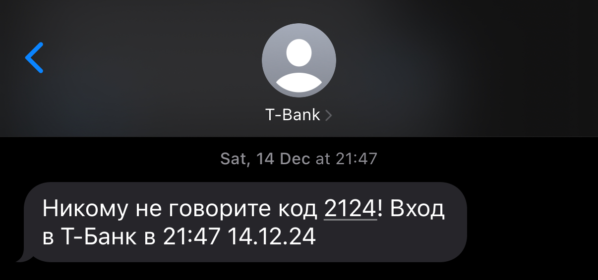

---
layout:
  title:
    visible: true
  description:
    visible: true
  tableOfContents:
    visible: true
  outline:
    visible: true
  pagination:
    visible: true
---

# Как распознать попытку обмана

### **1. Вас просят назвать код из SMS**

**Кто может попросить код из SMS? Никто.** Даже если звонящий представляется сотрудником банка, полиции или службы поддержки, это мошенники. Настоящие сотрудники никогда не будут просить ваш код.


Если сомневаетесь, положите трубку и перезвоните в официальную службу поддержки.


Код не может использоваться для подтверждения заявки, вашей личности или регистрации где-либо.&#x20;

Не может использоваться для записи на прием к врачу.&#x20;

***

### **2. Вас торопят и требуют срочно назвать код**

Это явный признак обмана. Легитимные организации не создают искусственной срочности. Если вас торопят или запугивают, положите трубку и перезвоните в официальную службу поддержки.

Завтра отключат телефон? - это создание срочности

***

### **3. Несоответствие отправителя SMS**

Обратите внимание на отправителя SMS. Например, если вас просят подтвердить доставку цветов, а код приходит от банка или Госуслуг, это обман. Код должен приходить от сервиса, связанного с операцией.

Многие банки и сервисы добавляют в SMS предупреждения, например: "Никому не сообщайте этот код" или "Этот код запрашивает только наше приложение". Обращайте на это внимание.&#x20;

<figure><figcaption>
Пример сообщения от Госуслуг
</figcaption></figure>

А еще сервисы указывают для чего именно будет использоваться код: вход в аккаунт, подтверждение операции или что-то другое.&#x20;

> Однажды мне позвонили, якобы из службы безопасности Банка. Когда я начала сомневаться, женщина на другом конце сказала: "Чтобы Вы убедились, что я действительно сотрудник, я направлю вам SMS от нашего банка с кодом".  Она еще добавил, что не надо сообщать ей код из сообщения, "потому что код просят только мошенники". &#x20;
>
> И в этот момент мне действительно пришло сообщение от Банка с кодом. \
> Но код был для входа в личный кабинет.&#x20;

Официальные SMS от банка приходят с короткого номера (например, 900), а не с обычных номеров телефонов.


Всегда внимательно смотрите не только от кого SMS, но и для чего может быть использован код


<figure><figcaption>
Код от банка для входа в личный кабинет. 
</figcaption></figure>

***

### **4. Звонок с незнакомого номера**

Если звонят с незнакомого номера и начинают задавать личные вопросы, это повод насторожиться. Если вам с звонят с госуслуг, службы безопасности, правоохранительных органов - тоже - эти организации никогда не звонят первыми.&#x20;

На странице [#kak-raspoznat-moshennikov](../calls/#kak-raspoznat-moshennikov "mention") я подробнее расскажу, как понять, что звонок подозрительный и что делать.&#x20;
