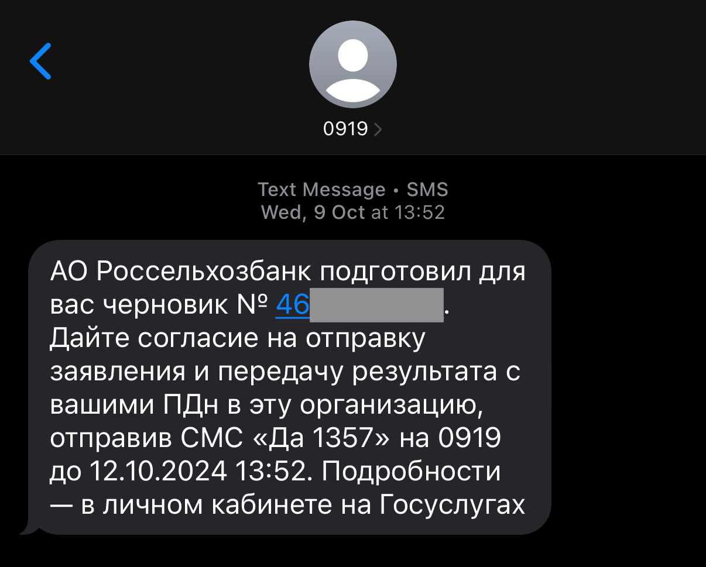

# Защита аккаунта Госуслуг от мошенников

В этой главе:\
[#pochemu-vazhno-zashishat-akkaunt-gosuslug](zashita-akkaunta-gosuslug-ot-moshennikov.md#pochemu-vazhno-zashishat-akkaunt-gosuslug "mention")\
[#kak-moshenniki-mogut-poluchit-dostup-k-akkauntu](zashita-akkaunta-gosuslug-ot-moshennikov.md#kak-moshenniki-mogut-poluchit-dostup-k-akkauntu "mention")\
[#primery-iz-zhizni](zashita-akkaunta-gosuslug-ot-moshennikov.md#primery-iz-zhizni "mention")\
[#kak-zashitit-akkaunt-gosuslug-prakticheskie-sovety](zashita-akkaunta-gosuslug-ot-moshennikov.md#kak-zashitit-akkaunt-gosuslug-prakticheskie-sovety "mention")\
[#chto-delat-esli-akkaunt-gosuslug-vzlomali](zashita-akkaunta-gosuslug-ot-moshennikov.md#chto-delat-esli-akkaunt-gosuslug-vzlomali "mention")


Информация в курсе не исчерпывающая — мошенники постоянно изобретают новые методы.

Переход по внешним ссылкам и использование данных — ваша ответственность. Всегда проверяйте информацию в официальных источниках.



Рекомендации в этом разделе применимы для обеспечения безопасности любых аккаунтов в Интернете.&#x20;


### **Почему важно защищать аккаунт Госуслуг**

Аккаунт Госуслуг — это ключ к огромному количеству персональных данных и государственных услуг: в нем хранятся паспортные данные, ИНН, СНИЛС, водительские права, информация о налогах, пенсиях, медицинских услугах и многое другое.&#x20;

Учетная запись на Госуслугах бывает трех уровней: **упрощенная**, **стандартная** и **подтвержденная**. Подтвержденная учетная запись — это самый высокий уровень, который открывает доступ ко всем функциям портала.

Если мошенники получат доступ к вашему аккаунту, они смогут не только украсть ваши личные данные, но и воспользоваться ими для оформления кредитов, получения государственных выплат, изменения реквизитов для перевода пособий или даже совершения мошеннических действий от вашего имени.&#x20;

#### **Как проверить уровень учетной записи?**

1. Войдите в аккаунт на сайте Госуслуг.
2. Перейдите в раздел "Профиль" или "Настройки".
3. Найдите информацию о статусе учетной записи.

Защита аккаунта Госуслуг — это не просто рекомендация, а необходимость для обеспечения вашей цифровой безопасности

> В Раменках парень выпал из окна и погиб после того, как его Госуслуги взломали. Предварительно, он совершил суицид. Мошенники получили доступ к его личному кабинету в Госуслугах. Потом парню начали приходить уведомления о махинациях с его недвижимостью. Молодой человек очень переживал, что останется без квартиры и в один из дней выпал с 15 этажа своего дома.
>
> _Источник:_ [https://t.me/moscowmap](https://t.me/moscowmap)


В России можно формить запрет на сделки с недвижимостью без личного участия. Эта мера защиты позволяет владельцу недвижимости контролировать любые действия, связанные с его имуществом. Внесение соответствующей записи в ЕГРН (Единый государственный реестр недвижимости) гарантирует, что никакие сделки, включая продажу, дарение, или использование недвижимости в качестве залога, не могут быть осуществлены без личного участия собственника.&#x20;


### **Как мошенники могут получить доступ к аккаунту**

Мошенникам для доступа к аккаунту Госуслуг чаще всего нужны **логин** (номер телефона или email), **пароль** и **код подтверждения** из SMS (если включена двухфакторная аутентификация). Вот откуда они могут получить эти данные:

#### **Логин (номер телефона или email)**

* **Социальные сети и открытые источники:** Если вы указываете номер телефона или email в публичных профилях, мошенники могут легко их найти.
* **Утечки данных:** В результате взломов других сервисов (например, интернет-магазинов, соцсетей) ваши контактные данные могут попасть в руки злоумышленников.

#### **Пароль**

* **Фишинг:** Поддельные сайты или письма, которые имитируют Госуслуги, могут заставить вас ввести пароль и самостоятельно передать его в руки мошшеников. Поэтому нельзя переходить по подозрительным ссылкам из сообщений, мессенджеров и писем электронной почты.&#x20;


На странице [Госуслуг о фишинге](https://www.gosuslugi.ru/life/details/dont_get_caught_phishing) представлена полезная информация о том, как распознать и защититься от фишинговых атак:

* Внимательно проверяйте адрес отправителя и адрес ссылок
* Меняйте пароли в самом сервисе, а не при переходе по ссылкам
* Скачивайте программы из официальных магазинов приложений


* **Утечки данных:** Если вы используете один и тот же пароль на нескольких сайтах, его могут украсть при взломе другого сервиса.\
  Не используйте один и тот же пароль везде.&#x20;
* **Подбор (брутфорс):** Мошенники используют программы для перебора простых паролей (например, "123456" или "qwerty"). \
  Используйте сложные пароли со строчными, заглавными буквами и специальными символами.&#x20;
* **Социальная инженерия:** Злоумышленники могут убедить вас раскрыть пароль, например, в ходе телефонного разговора под предлогом "проверки безопасности".
* **Вредоносные программы:** Вирусы на вашем устройстве могут записывать вводимые пароли. \
  Не устанавливайте приложения из недоверенных источников и используйте антивирус на своих устройствах.&#x20;

Если аккаунт не защищен двухфакторной аутентификацией, то этой информации будет достаточно, чтобы получить к нему полный доступ. Иначе им потребуется еще узнать код из SMS-сообщения, которое придет на ваш номер телефона &#x20;

Что такое <strong>двухфакторная аутентификация</strong>?

**2FA (двухфакторная аутентификация)** — это дополнительная защита аккаунта, которая требует не только пароля, но и специального кода (из SMS или приложения). Она нужна, чтобы мошенники не смогли войти в ваш аккаунт, даже если узнают пароль.


Настройте или попросите близких настроить двухфакторную аутентификацию


#### **Код из SMS (для двухфакторной аутентификации)**

* **SIM-свопиг:** Мошенники могут убедить мобильного оператора перевыпустить вашу SIM-карту на их устройство, чтобы перехватывать SMS.


В этом случае ваша старая SIM-карта перестанет функционировать, а мошенники еще сутки не смогут получать SMS-сообщения на новую. \
Используйте это время, чтобы восстановить доступ к своей SIM-карте.&#x20;


* **Социальная инженерия:** Звонок от "сотрудника Госуслуг" с просьбой продиктовать код из SMS для "подтверждения личности" или "продления договора обслуживания SIM-карты". \
  [lozhnye-zvonki-ot-pravookhranitelnykh-organov-rodstvennikov-ili-nachalstva.md](lozhnye-zvonki-ot-pravookhranitelnykh-organov-rodstvennikov-ili-nachalstva.md "mention")
* **Вредоносные программы:** Некоторые вирусы могут перехватывать SMS-сообщения на вашем телефоне.
* **Фишинг:** Поддельные формы на сайтах или в приложениях могут запрашивать код из SMS.

Чтобы защититься, важно использовать уникальные сложные пароли, включать двухфакторную аутентификацию и быть бдительным при получении подозрительных сообщений или звонков.

### Примеры из жизни

> Злоумышленники, представляясь сотрудниками оператора сотовой связи, звонят и сообщают, что срок действия договора на обслуживание вашего номера подходит к концу. Они предлагают быстро продлить договор через портал Госуслуг, утверждая, что для этого оператору необходимо направить запрос на получение ваших паспортных данных. Чтобы подтвердить запрос, вас просят назвать код из SMS. В этот момент на ваш телефон приходит сообщение с кодом доступа от Госуслуг

#### Могут ли сервисы запрашивать доступ к вашим данным через госуслуги?

Да, могут. Например, банки могут использовать этот способ для быстрого подтверждения заявки на кредит. **Но подтвеждение НИКОГДА НЕ происходит через код из SMS.** \
Банк направляет заявку в личный кабинет. Вам необходимо авторизоваться самостоятельно (никому не сообщая код) и в разделе "Уведомления" или "Заявки" найти запрос от банка. И подтвердить запрос данных.&#x20;

#### Можно ли называть код из SMS?

Нет. Никогда и никому.&#x20;

Пример, как выглядит подверждение заявки на доступ к данным через Госуслуги. Код сообщать никому не нужно. Только отправить ответное SMS. Все действия только на вашей стороне.&#x20;

<figure><figcaption>
Пример SMS для подтверждения заявки. 0919 - официальный номер госуслуг
</figcaption></figure>

### **Как защитить аккаунт Госуслуг: практические советы**

Защита аккаунта Госуслуг требует комплексного подхода. Вот основные практические советы, которые помогут вам обезопасить свои данные:

***

#### **1. Создание надежного пароля**

* **Используйте сложные комбинации:** Пароль должен состоять из букв (в верхнем и нижнем регистре), цифр и специальных символов (например, `!`, `@`, `#`). Например, вместо простого пароля «123456» используйте что-то вроде «Mama2023!» комбинация из
* **Избегайте простых паролей:** Не используйте очевидные комбинации, такие как `123456`, `qwerty` или `password`. Не используйте имена родственников или дату рождения в качестве пароля. Простые пароли легко взломать, особенно если мошенники мошенники знают базовую информацию о вас (дату рождения, имя родственника и т.д.).&#x20;
* **Уникальность пароля:** Не используйте один и тот же пароль для разных сервисов. Если один аккаунт взломают, остальные останутся защищенными.
* **Хранение пароля:** Для хранения паролей лучше всего использовать парольные менеджеры - как встроенные в браузер, так и сторонние программы.&#x20;


Если вы храните пароли в браузере, то ваше устройство должно быть обязательно защищено паролем. Чтобы мошенники не смогли получить доступ к вашим паролям в случае утери или кражи устройства.&#x20;


***

#### **2. Включение двухфакторной аутентификации (2FA)**

* **Как это работает:** После ввода пароля вам нужно ввести дополнительный код, который приходит в SMS.
* **Почему это важно:** Даже если мошенники узнают ваш пароль, без кода они не смогут войти в аккаунт.&#x20;

***

#### **3. Защита номера телефона**

* **Установите PIN-код на SIM-карту:** Это предотвратит перевыпуск SIM-карты без вашего ведома.
* **Контролируйте активность:** При перевыпуске SIM-карты, ваша существующая отключается. Однако на новую карту SMS не будут приходить еще сутки, это сделано для того, чтобы защитить пользователей от данного вида мошенничества. Если вы не можете получать звонки и SMS и постоянно "нет сети", немедленно свяжитесь с оператором — возможно, мошенники перевыпустили вашу SIM-карту.

***

#### **4. Осторожность с письмами, SMS и звонками**

> Мошенники стали подделывать справочные сайты и публиковать на них фейковые номера служб поддержки Госуслуг. Также злоумышленники рассылают SMS-сообщения о якобы неудачной попытке входа или взломе аккаунта Госуслуг и в них же указывают поддельный номер службы поддержки. А потом получают доступ к личному кабинету.
>
> _Источник_: [https://t.me/moscowmap](https://t.me/moscowmap)

* **Не переходите по подозрительным ссылкам из сообщений и мессенджеров.**&#x20;
* **Проверяйте адрес сайта:** Официальный сайт Госуслуг — `https://www.gosuslugi.ru`. Убедитесь, что адрес в браузере совпадает. \
  Используйте **официальное приложение**. Где скачать:
  * [App Store](https://apps.apple.com/ru/app/%D0%B3%D0%BE%D1%81%D1%83%D1%81%D0%BB%D1%83%D0%B3%D0%B8/id1361573947) для iOS
  * [Google Play](https://play.google.com/store/apps/details?id=ru.rostelecom.rt) для Android
* **Не сообщайте коды подтверждения:** Никогда не делитесь кодами из SMS или приложений, даже если звонящий представляется сотрудником Госуслуг.
* **Проверяйте адреса и номера:** \
  Официальный номер: 0919\
  Официальные письма приходят с адреса `no-reply@gosuslugi.ru.`&#x20;


Не стоит доверять информации даже на этой странице. Это не официальный сайт!\
Проверенная, достоверная и безопасная информация только на официальном сайте.&#x20;


***

#### **5. Безопасность устройства**

* **Скачивайте приложения только из официальных магазинов:** Например, App Store или Google Play.
* **Установите антивирус:** Защитите свое устройство от вредоносных программ, которые могут украсть данные.
* **Обновляйте ПО:** Регулярно обновляйте операционную систему и приложения, чтобы закрыть уязвимости.

***

#### **6. Регулярная проверка активности в аккаунте**

* **Проверяйте историю входов:** В настройках аккаунта Госуслуг можно посмотреть, с каких устройств и когда был выполнен вход. Если вы заметили подозрительную активность, немедленно смените пароль.\
  В разделе "Настройки" → "Безопасность" найдите пункт "История входов"
* **Отключайте неиспользуемые устройства:** Если вы больше не используете какое-то устройство для входа, удалите его из списка доверенных.

***

#### **7. Обучение и информирование**

* **Расскажите близким:** Объясните родственникам, особенно пожилым, как защитить свои аккаунты и почему это важно.
* **Следите за новостями:** Регулярно проверяйте официальные источники (сайт Госуслуг, их соцсети) на предмет новых угроз и способов защиты.

Ссылка на инструкции по безопасности с официального сайта "[Как защитить учётную запись на Госуслугах](https://www.gosuslugi.ru/help/faq/personal_data/100465?fromMain=true)".&#x20;


А ты убедился, что ссылка ведет действительно на официальный сайт?


### **Что делать, если аккаунт Госуслуг взломали**

Если вы подозреваете, что ваш аккаунт Госуслуг взломали, важно действовать быстро, чтобы минимизировать ущерб.

***

#### **1. Немедленно смените пароль**

* **Как это сделать:**
  1. Перейдите на официальный сайт Госуслуг: [gosuslugi.ru](https://www.gosuslugi.ru).
  2. Нажмите "Войти" и выберите "Забыли пароль?".
  3. Следуйте инструкциям для восстановления доступа и установите новый **сложный пароль**.
* **Важно:** Новый пароль должен быть уникальным и не использоваться на других сайтах.

***

#### **2. Отключите подозрительные устройства**

* **Как это сделать:**
  1. Войдите в аккаунт Госуслуг.
  2. Перейдите в раздел "Настройки" → "Безопасность".
  3. Проверьте список устройств, с которых выполнялся вход.
  4. Если вы видите незнакомые устройства, нажмите "Завершить все сеансы".
* **Зачем это нужно:** Это предотвратит дальнейший доступ мошенников к вашему аккаунту.

***

#### **3. Проверьте историю действий в аккаунте**

* **Как это сделать:**
  1. В разделе "Настройки" → "Безопасность" найдите пункт "История входов".
  2. Проверьте, когда и с каких устройств выполнялись входы.
* **Что искать:** Подозрительные действия, такие как входы в необычное время или с неизвестных устройств.

***

#### **4. Включите двухфакторную аутентификацию (если она не была включена)**

* **Как это сделать:**
  1. В разделе "Настройки" → "Безопасность" найдите пункт "Двухфакторная аутентификация".
  2. Подключите ее, используя приложение для генерации кодов (например, Google Authenticator) или SMS.
* **Зачем это нужно:** Это добавит дополнительный уровень защиты.

***

#### **5. Проверьте и восстановите измененные данные**

* **Что проверять:**
  * Личные данные (ФИО, паспортные данные, ИНН, СНИЛС).
  * Привязанные номера телефонов и email.
  * Настройки уведомлений (чтобы мошенники не отключили их).
* **Если данные изменены:**
  1. Обратитесь в техподдержку Госуслуг.
  2. Подготовьте документы для подтверждения личности (паспорт, СНИЛС).

***

#### **6. Обратитесь в техподдержку Госуслуг**

* **Как связаться:**
  * По телефону: **актуальный номер только на официальном сайте**
  * Через форму обратной связи на **официальном** сайте.&#x20;
* **Что сообщить:**
  * Что ваш аккаунт был взломан.
  * Какие действия вы уже предприняли (смена пароля, отключение устройств).
  * Если мошенники успели что-то изменить, предоставьте доказательства (например, скриншоты).

***

#### **7. Заблокируйте подозрительные операции**

Если мошенники успели что-то сделат&#x44C;**, н**апример, оформили кредит или изменили реквизиты для получения выплат.

* **Что делать:**
  1. Немедленно свяжитесь с организацией, которая была вовлечена (банк, Пенсионный фонд и т.д.).
  2. Подайте заявление о блокировке подозрительных операций.

***

#### **8. Сообщите о взломе в правоохранительные органы**

* **Как это сделать:**
  1. Обратитесь в ближайшее отделение полиции.
  2. Напишите заявление о мошенничестве.
  3. Приложите все доказательства (скриншоты, выписки, письма от техподдержки).
* **Зачем это нужно:** Это поможет начать расследование и, возможно, вернуть утраченные средства.

***

#### **9. Уведомите близких и работодателя (если необходимо)**

* **Если мошенники получили доступ к вашим данным:**
  * Предупредите близких, чтобы они были осторожны с подозрительными звонками или сообщениями.

***

#### **10. Усильте защиту других аккаунтов**

* **Почему это важно:** Если вы использовали одинаковые пароли на разных сайтах, другие аккаунты также могут быть под угрозой.
* **Что делать:**
  1. Смените пароли на всех важных сервисах (банки, почта, соцсети).
  2. Включите двухфакторную аутентификацию везде, где это возможно.

### **Итог**

Защита аккаунта Госуслуг — это не разовое действие, а постоянный процесс. Используйте сложные пароли, включайте двухфакторную аутентификацию, будьте осторожны с подозрительными сообщениями и регулярно проверяйте активность в аккаунте. Эти простые шаги значительно снизят риск взлома и помогут сохранить ваши данные в безопасности.
