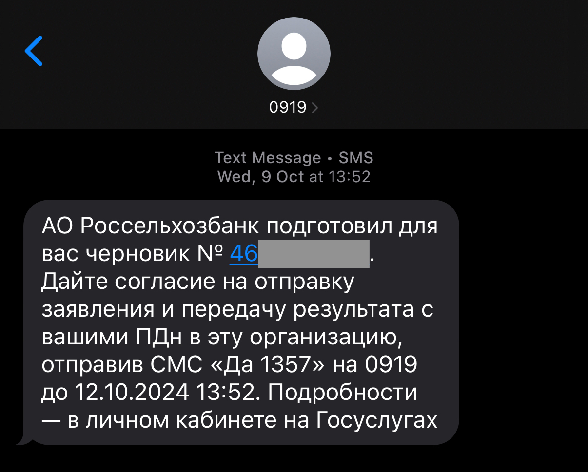

# Как мошенники могут получить доступ к аккаунту

Мошенникам для доступа к аккаунту Госуслуг чаще всего нужны **логин** (номер телефона или email), **пароль** и **код подтверждения** из SMS (если включена двухфакторная аутентификация). Вот откуда они могут получить эти данные:

#### **Логин (номер телефона или email)**

* **Социальные сети и открытые источники:** Если вы указываете номер телефона или email в публичных профилях, мошенники могут легко их найти.
* **Утечки данных:** В результате взломов других сервисов (например, интернет-магазинов, соцсетей) ваши контактные данные могут попасть в руки злоумышленников.

#### **Пароль**

* **Фишинг:** Поддельные сайты или письма, которые имитируют Госуслуги (или банка, или любой другой организации), могут заставить вас ввести пароль и самостоятельно передать его в руки мошшеников. Поэтому нельзя переходить по подозрительным ссылкам из сообщений, мессенджеров и писем электронной почты.&#x20;


Действия Остапа Бендера - отличный пример фишинга. Только представьте, если бы он жил в 2025 году и мог использовать интернет для достижения своих целей.&#x20;


Что такое фишинг

Фишинг — это как **ловля рыбы**, только вместо рыбы мошенники "ловят" ваши личные данные: пароли, номера карт, паспортные данные и другую важную информацию. Вот как это работает:

***

#### **1. Как это выглядит?**

* **Поддельные письма или сообщения:** Мошенники присылают вам письмо, SMS или сообщение в мессенджере, которое выглядит как официальное уведомление. Например, от банка, Госуслуг или популярного сервиса.
* **Срочность:** В сообщении часто пишут что-то вроде: "Ваш аккаунт заблокирован!", "Неуплата штрафа!" или "Срочно подтвердите данные!".
* **Ссылка:** В письме или сообщении есть ссылка, которая ведет на поддельный сайт, похожий на настоящий.

#### **2. Что происходит дальше?**

* Вы переходите по ссылке и попадаете на фальшивый сайт.
* Вас просят ввести личные данные: логин, пароль, номер карты, код из SMS или паспортные данные.
* Как только вы вводите эти данные, мошенники их "забирают" и используют для своих целей: взламывают аккаунты, крадут деньги или продают информацию.

#### **4. Как не попасться на фишинг?**

* **Не переходите по подозрительным ссылкам.** Если получили письмо или SMS, не нажимайте на ссылку. Лучше зайдите на сайт вручную.
* **Проверяйте адрес сайта.** Официальные сайты всегда имеют правильное написание (например, **https://www.gosuslugi.ru**).
* **Не передавайте коды из SMS.** Никогда не сообщайте коды подтверждения, даже если звонящий представляется сотрудником банка или Госуслуг.

***

Фишинг — это обман, когда мошенники пытаются выманить у вас личные данные, притворяясь официальными организациями. Будьте внимательны: не переходите по подозрительным ссылкам, не передавайте коды из SMS и всегда проверяйте адреса сайтов. Это поможет вам сохранить свои данные и деньги в безопасности.


На странице [Госуслуг о фишинге](https://www.gosuslugi.ru/life/details/dont_get_caught_phishing) представлена полезная информация о том, как распознать и защититься от фишинговых атак:

* Внимательно проверяйте адрес отправителя и адрес ссылок
* Меняйте пароли в самом сервисе, а не при переходе по ссылкам
* Скачивайте программы из официальных магазинов приложений


* **Утечки данных:** Если вы используете один и тот же пароль на нескольких сайтах, его могут украсть при взломе другого сервиса.\
  Не используйте один и тот же пароль везде.&#x20;
* **Подбор (брутфорс):** Мошенники используют программы для перебора простых паролей (например, "123456" или "qwerty"). \
  Используйте сложные пароли со строчными, заглавными буквами и специальными символами.&#x20;
* **Социальная инженерия:** Злоумышленники могут убедить вас раскрыть пароль, например, в ходе телефонного разговора под предлогом "проверки безопасности".
* **Вредоносные программы:** Вирусы на вашем устройстве могут записывать вводимые пароли. \
  Не устанавливайте приложения из недоверенных источников и используйте антивирус на своих устройствах.&#x20;

Если аккаунт не защищен двухфакторной аутентификацией, то этой информации будет достаточно, чтобы получить к нему полный доступ. Иначе им потребуется еще узнать код из SMS-сообщения, которое придет на ваш номер телефона &#x20;

Что такое <strong>двухфакторная аутентификация</strong>?

**2FA (двухфакторная аутентификация)** — это дополнительная защита аккаунта, которая требует не только пароля, но и специального кода (из SMS или приложения). Она нужна, чтобы мошенники не смогли войти в ваш аккаунт, даже если узнают пароль.


Настройте или попросите близких настроить двухфакторную аутентификацию


#### **Код из SMS (для двухфакторной аутентификации)**

* **SIM-свопиг:** Мошенники могут убедить мобильного оператора перевыпустить вашу SIM-карту на их устройство, чтобы перехватывать SMS.


В этом случае ваша старая SIM-карта перестанет функционировать, а мошенники еще сутки не смогут получать SMS-сообщения на новую. \
Используйте это время, чтобы восстановить доступ к своей SIM-карте.&#x20;


* **Социальная инженерия:** Звонок от "сотрудника Госуслуг" с просьбой продиктовать код из SMS для "подтверждения личности" или "продления договора обслуживания SIM-карты". \
  [lozhnye-zvonki-ot-pravookhranitelnykh-organov-rodstvennikov-ili-nachalstva](../lozhnye-zvonki-ot-pravookhranitelnykh-organov-rodstvennikov-ili-nachalstva/ "mention")
* **Вредоносные программы:** Некоторые вирусы могут перехватывать SMS-сообщения на вашем телефоне.
* **Фишинг:** Поддельные формы на сайтах или в приложениях могут запрашивать код из SMS.

Чтобы защититься, важно использовать уникальные сложные пароли, включать двухфакторную аутентификацию и быть бдительным при получении подозрительных сообщений или звонков.

### Примеры из жизни

> Злоумышленники, представляясь сотрудниками оператора сотовой связи, звонят и сообщают, что срок действия договора на обслуживание вашего номера подходит к концу. Они предлагают быстро продлить договор через портал Госуслуг, утверждая, что для этого оператору необходимо направить запрос на получение ваших паспортных данных. Чтобы подтвердить запрос, вас просят назвать код из SMS. В этот момент на ваш телефон приходит сообщение с кодом доступа от Госуслуг

#### Могут ли сервисы запрашивать доступ к вашим данным через госуслуги?

Да, могут. Например, банки могут использовать этот способ для быстрого подтверждения заявки на кредит. **Но подтвеждение НИКОГДА НЕ происходит через код из SMS.** \
Банк направляет заявку в личный кабинет. Вам необходимо авторизоваться самостоятельно (никому не сообщая код) и в разделе "Уведомления" или "Заявки" найти запрос от банка. И подтвердить запрос данных.&#x20;

#### Можно ли называть код из SMS?

Нет. Никогда и никому.&#x20;

Пример, как выглядит подверждение заявки на доступ к данным через Госуслуги. Код сообщать никому не нужно. Только отправить ответное SMS. Все действия только на вашей стороне.&#x20;

<figure><figcaption>
Пример SMS для подтверждения заявки. 0919 - официальный номер госуслуг
</figcaption></figure>
